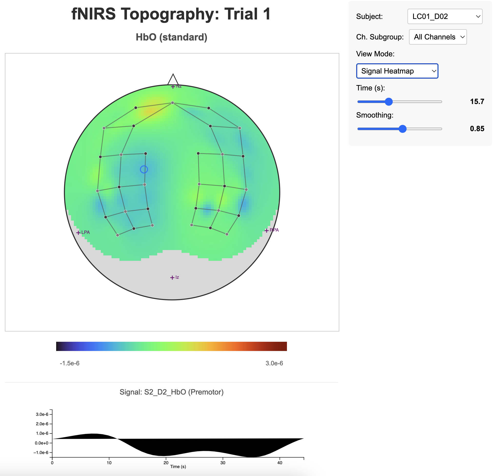
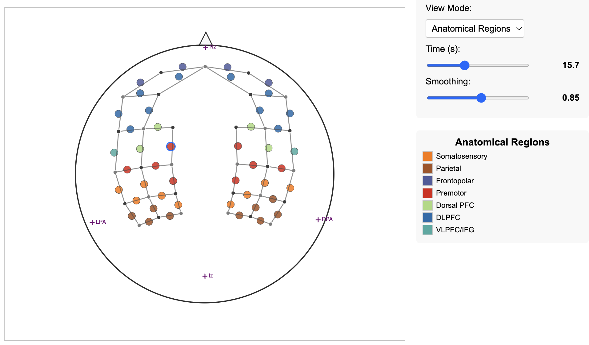

# Interactive fNIRS Topography Pipeline

[](https://opensource.org/licenses/MIT)

Python pipeline to process trial-based fNIRS data, perform MNI co-registration for anatomical localization, and generate interactive HTML visualizations. Features 3D spatial interpolation projected onto a 2D topographic view with clickable channel time series.




## Key Features

*   **Interactive Topography:** Visualizes fNIRS activation via heatmap or anatomical regions.
*   **Anatomical Localization:** Co-registers channel data to MNI space and maps to Brodmann/custom regions using a NIfTI atlas.
*   **3D Interpolation & 2D Projection:** Uses 3D channel coordinates (Inverse Distance Weighting) for interpolation, projected to 2D (Azimuthal Equidistant) for viewing.
*   **Subject/Time/Subgroup Selection:** Dropdowns and sliders for interactive exploration.
*   **Clickable Time Series:** View individual channel signals by clicking on the map.
*   **Optional HTA Averaging:** Supports Hemodynamic Task Averaging via Excel input.
*   **Modular Code:** Refactored Python structure for better maintainability.
*   **Self-Contained HTML Output:** Embeds data and JS (D3.js v7) for easy sharing.

## Dependencies

*   Python (3.8+)
*   NumPy, Pandas, SciPy, Nibabel, MNE-Python, openpyxl

```bash
pip install numpy pandas scipy nibabel mne openpyxl```

## Installation

1.  **Clone:** `git clone <your-repo-url> && cd <your-repo-name>`
2.  **Install Deps:** `pip install -r requirements.txt` (or use the command above)
3.  **Download fsaverage:** If needed, run `import mne; mne.datasets.fetch_fsaverage(verbose=True)` in Python.
4.  **Get Atlas Files:** Place Brodmann atlas files (`.nii.gz`, `.txt`) in `Brodmann_MM/` or configure path in `anatomical.py`.

## Usage

1.  **Configure:** Edit parameters (paths, HTA, SRATE, etc.) in `main_script.py`.
2.  **Run:** `python main_script.py`
3.  **View:** Open generated `.html` files (in `visualizations_.../`) in a web browser.

## Input Data Summary

*   **Signal Data:** `SubjectID_TrialNum.txt` (CSV, specific header format required).
*   **Digitizer Data:** `digpts.txt` (Name: X Y Z).
*   **Anatomical Atlas:** NIfTI file (`.nii.gz`) + Label file (`.txt`).
*   **HTA Data (Optional):** `.xlsx` file with event timings per subject.

*(See `DOCUMENTATION.md` for detailed format requirements)*

## Data Source Reference

Sample data used during development was derived from the publicly available ASTaUND dataset:
*   Kamat, Anil; Eastmond, Condell; Gao, Yuanyuan; Nemani, Arun; Yanik, Erim; Cavuoto, Lora; et al. (2023). Assessment of Surgical TAsks Using Neuroimaging Dataset (ASTaUND). figshare. Collection. https://doi.org/10.6084/m9.figshare.c.6429713.v1

## Citation

If using this tool, please cite:
*   CeMSIM (2025). Interactive fNIRS Topography Pipeline (Version X.Y.Z). GitHub Repository. [Link](https://github.com/axiom5/fNIRS_topoviewer/) *(Replace link/version)*

## License

MIT License - see [LICENSE](LICENSE) file.

## Further Information

For technical details (workflow, registration, projection, interpolation, limitations, configuration, file formats), see **[DOCUMENTATION.md](DOCUMENTATION.md)**.